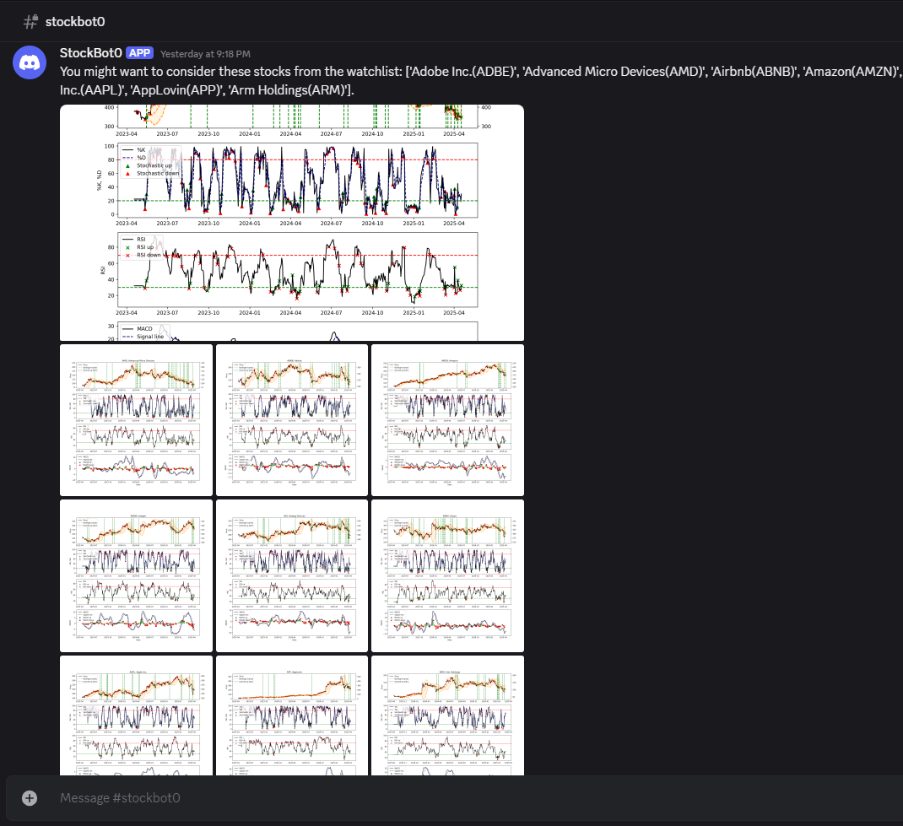

# Stock Screening Bot with Python and Discord

This simple bot pulls data from Yahoo Finance, screens a list of stocks using technical indicators (Stochastic Oscillator, RSI, and MACD), then sends charts and recommendations to a Discord channel.

See the Medium article for more details: [*Building a Stock Screening Bot with Python and Discord*](https://medium.com/@kinran_lau/building-a-stock-screening-bot-with-python-and-discord-44d2c071af79).

## How to Use

1. **Set up your environment variables:**

   Create a `.env` file or copy from `.env.example`, and fill in your target channel ID and Discord bot token
   - Channel ID can be obtained by right-clicking the Discord channel.
   - Token can be retrieved from the Discord web app https://discord.com/app (see [MarvNC's tutorial](https://gist.github.com/MarvNC/e601f3603df22f36ebd3102c501116c6) for detailed instructions)

3. **Dependencies:**
   
   See `requirements.txt`

4. **Modify the stock list (optional):**

    By default, the bot uses `#nasdaq100.csv` as the watchlist. You can replace this file with your own CSV, but should contain the columns (`Ticker`, `Company`).

4. **Run the bot:**
   
    `python discord_bot.py`
  ---
  **Notes**
  - The bot will analyze stocks, generate plots in the `image/` folder, and send recommendations and charts to your Discord channel.
  - Default data range for each stock is 2 years, which can be changed in `stock_analysis.py`
  - Only 10 images can be sent per message due to Discord’s API limits — the bot sends them in batches.
  - Output images will be saved in the `image/` directory.
  - The example analysis was done on 20 April 2025
